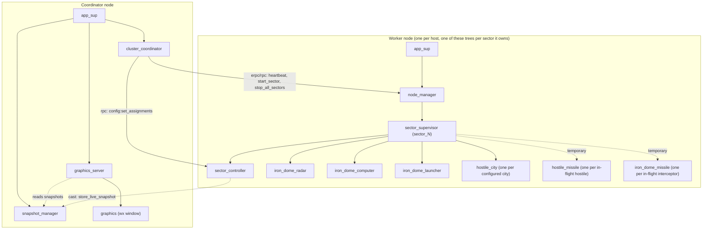
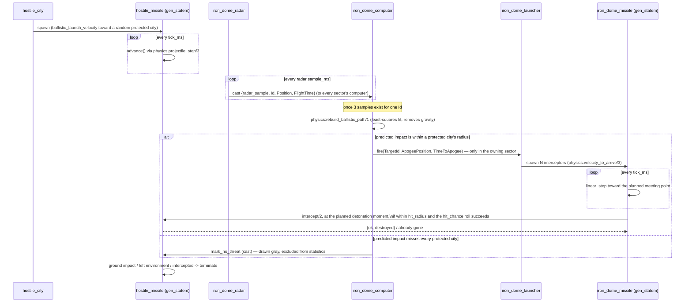
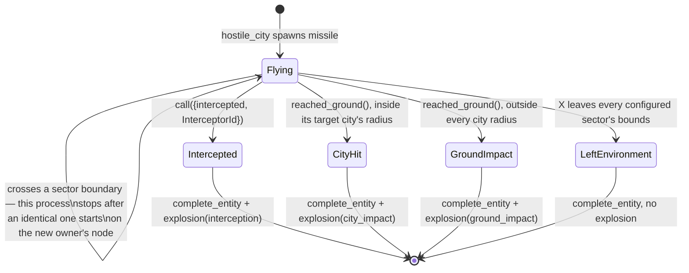
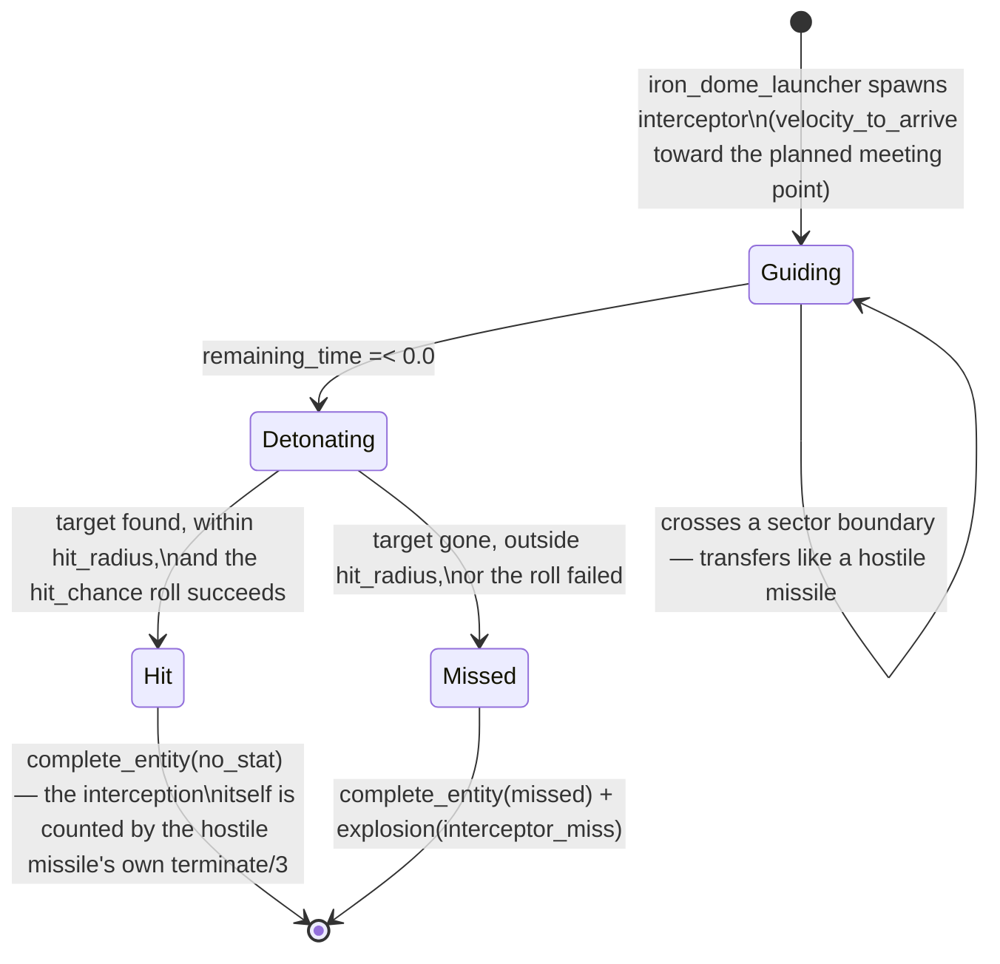
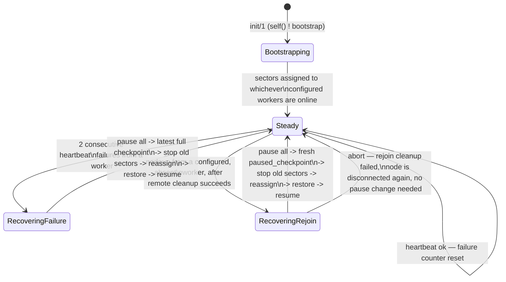
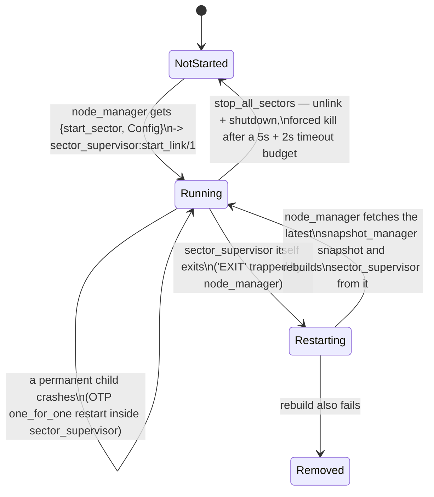

# Distributed Iron Dome — Project Report

Companion document to [`README.md`](README.md), which covers installation
and how to run the system. This report covers how the system is built:
process structure, module responsibilities, the interfaces between nodes,
and the state machines that drive individual missiles and the cluster as a
whole.

## 1. Introduction

Distributed Iron Dome is an Erlang/OTP simulation of a layered air-defense
system. Hostile cities launch ballistic missiles; radars sample their
positions; computers reconstruct their trajectories and decide whether they
threaten a protected city; launchers fire interceptors at a predicted
meeting point; interceptors detonate and roll for a hit. All of this runs
distributed across a small cluster of Erlang nodes, split into four
geographic "sectors," with automatic failover when a worker node goes down
mid-simulation and rejoins later.

As an OTP project it is deliberately built to demonstrate: supervision
trees at multiple granularities, `gen_server`/`gen_statem` process design,
distributed Erlang (multi-node messaging, RPC, code loading), ETS as
node-local shared state, and a live-updatable simulation driven by a
`wxWidgets` front end — all while keeping cluster orchestration cleanly
separated from simulation logic.

## 2. System Topology

One **coordinator** node and any number of **worker** nodes. The
coordinator never runs simulation content itself — it only assigns sectors
to workers, monitors them, and renders the shared graphics view.

The coordinator does not host sectors even if every worker is offline — a
sector with no live worker is simply displayed as unowned
(`NO NODE AVAILABLE`) until one appears.

## 3. Process & Supervision Trees

Fault handling exists at three distinct granularities, each using a
different OTP mechanism:

1. **Within a sector** — `sector_supervisor` is a plain OTP `supervisor`
   (`one_for_one`, intensity 5 / period 10). If one of its permanent
   children (`sector_controller`, `iron_dome_radar`, `iron_dome_launcher`,
   `iron_dome_computer`, or a `hostile_city`) crashes, OTP restarts just
   that process in place — the sector keeps running. Temporary children
   (individual `hostile_missile` / `iron_dome_missile` processes) are
   started and stopped dynamically via `sector_supervisor:start_child/5` and
   are *not* restarted on crash — a missile's disappearance ends its story,
   it doesn't respawn.

2. **Across a sector's own supervisor** — `node_manager` on each worker
   does **not** put `sector_supervisor` under an OTP supervisor. It calls
   `sector_supervisor:start_link/1` directly, keeping the link, with
   `process_flag(trap_exit, true)`. If the whole sector tree dies,
   `node_manager` receives `{'EXIT', SupervisorPid, Reason}` and manually
   rebuilds the sector using the latest snapshot fetched from
   `snapshot_manager` (`restart_sector_handler/3`). This is a deliberate
   departure from plain OTP restart semantics: a bare `one_for_one` restart
   would come back empty, losing every missile in flight — the manual path
   restores state first.

3. **Across the whole cluster** — `cluster_coordinator` is a `gen_server`,
   not a supervisor. It treats an entire *node* disappearing as the fault to
   recover from, using periodic heartbeats (`erpc:multicall/4`) plus
   Erlang's built-in `nodeup`/`nodedown` distribution events
   (`net_kernel:monitor_nodes/1`), not process links. Recovery here means
   pausing the whole simulation, taking a cluster-wide checkpoint,
   redistributing sectors among the workers that are still alive, and
   resuming — described in detail further down, in the state-machine
   section's look at `cluster_coordinator` and in the fault-tolerance
   section that follows it.

## 4. Module Reference

| Module | OTP behavior | Responsibility |
|---|---|---|
| `app` | `application` | Entry point OTP calls on startup/shutdown |
| `app_sup` | `supervisor` | Chooses coordinator vs. host children based on configured role |
| `config` | plain module | Shared read/write API over `application:get_env/set_env`; sector lookup by coordinate |
| `cluster_coordinator` | `gen_server` | Sector assignment, heartbeat monitoring, failover, node rejoin |
| `node_manager` | `gen_server` (traps exits) | Starts/stops/restarts sectors on one worker node |
| `snapshot_manager` | `gen_server` + ETS | Live per-sector snapshot cache (for graphics) and periodic whole-cluster checkpoints (for recovery) |
| `sector_supervisor` | `supervisor` | Permanent + temporary process tree for one sector |
| `sector_controller` | `gen_server` + ETS | Sector entity table, statistics, snapshot building, entity registration |
| `hostile_city` | `gen_server` | Periodically launches hostile missiles toward a random protected city |
| `hostile_missile` | `gen_statem` (`state_functions`) | Ballistic flight, sector transfer, interception/impact outcome |
| `iron_dome_radar` | `gen_server` | Samples local hostile positions, broadcasts observations to every sector's computer |
| `iron_dome_computer` | `gen_server` | Rebuilds trajectories from 3 observations, classifies threats, triggers engagements |
| `iron_dome_launcher` | `gen_server` | Spawns interceptor(s) for one engagement |
| `iron_dome_missile` | `gen_statem` (`state_functions`) | Guided flight toward a planned meeting point, detonation, hit/miss roll |
| `graphics_server` | `gen_server` | Owns the wx event loop, explosion effects, live control-panel actions |
| `graphics` | plain module | wx window/drawing primitives, frame rendering, input parsing |
| `physics` | plain module (pure functions) | Gravity/ballistics, trajectory reconstruction, aiming, distance/timing |

## 5. Interfaces

### 5.1 Cross-node interfaces

| Mechanism | Used for |
|---|---|
| `gen_server:call({Name, Node}, Msg)` | Location-transparent calls to a named process on a specific node — e.g. `node_manager:start_sector/2`, `sector_controller:accept_missile/3` when a missile transfers sectors, `snapshot_manager:snapshot/1` when a worker (which has no local ETS cache) asks the coordinator for a sector's last known state |
| `rpc:call/4`, `rpc:cast/4` | `cluster_coordinator` pushing configuration (`config:set_assignments/1`, `config:set_paused/1`), stopping remote applications during rejoin cleanup, `graphics` applying live control-panel settings to every node |
| `erpc:multicall/4` | Parallel heartbeat checks against every live worker with one shared timeout |
| `net_adm:ping/1`, `net_kernel:monitor_nodes/1` | Detecting nodes coming online and generating `nodeup`/`nodedown` events |
| `code:load_binary/3` over RPC | Pushing compiled `.beam` binaries from the coordinator to a worker, both during initial `deploy.escript` deployment and when a worker rejoins after being redeployed remotely |
| `erlang:disconnect_node/1` | Cleanly evicting a worker that failed too many heartbeats, from both the coordinator and every surviving peer |

### 5.2 Local (single-node) process APIs

Every simulation module exposes a small, typed function API over
`gen_server`/`gen_statem` calls and casts rather than exposing its internal
message format — callers never send raw messages. A few examples that
matter architecturally:

- `sector_controller:update_entity/3` writes directly to the sector's ETS
  table with `ets:update_element/3`, **bypassing the gen_server entirely**
  — this is deliberate: every missile process calls it once per tick, and
  routing that traffic through a single gen_server mailbox would make it a
  bottleneck. Reads (`hostile_positions/1`) go straight to ETS for the same
  reason.
- `sector_controller:accept_missile/3` / `accept_interceptor/3` are the
  hand-off points used when an entity's X position crosses into another
  sector; the fault-tolerance section below covers how this interacts
  with recovery.
- `iron_dome_computer` fires an engagement by resolving the *local*
  launcher through `sector_controller:launcher/1` — only the sector that
  contains the predicted meeting point is allowed to fire
  (`update_engagement/3` in `iron_dome_computer.erl`), even though every
  sector's computer independently receives every radar sample.

### 5.3 Node-local shared state

- **Per-sector ETS table** (`SectorId_entities`, named e.g. `sector_2_entities`):
  public, `{heir, sector_supervisor_pid, none}`. Missile processes own their
  row; the sector's radar and computer only read it. The `heir` option hands
  the table to the sector supervisor if the controller crashes, so a
  controller restart does not lose live entities — `monitor_table_entities/1`
  reattaches monitors to whatever is already in the table.
- **`snapshot_cache` ETS table** on the coordinator only (`protected`,
  `read_concurrency`): the latest live snapshot per sector, read directly by
  `graphics_server` every frame without going through a `gen_server` call.
- **`application:get_env`/`set_env`** (`config` module): node-local mutable
  configuration — simulation pause flag, tick interval, sector→node
  assignment map, tunable gameplay values. Each node keeps its own copy;
  nothing here is replicated automatically, it is pushed explicitly by
  `cluster_coordinator` (assignments, pause state) or by the graphics
  control panel (tunables) whenever it changes.

### 5.4 Entity identity scheme

Every missile ID encodes its **origin sector**, independent of which sector
currently owns the process: hostile missiles are
`{hostile_missile, {origin, SectorId}, CityId, Number}`, interceptors are
`{iron_dome_missile, {origin, SectorId}, LauncherId, Number, Index}`. This
lets `graphics` attribute in-flight counts to the sector that launched an
entity even after it has physically transferred elsewhere, without any
extra bookkeeping.

## 6. Simulation Data Flow

## 7. State Machines

### 7.1 `hostile_missile` — flight lifecycle

Implemented as a `gen_statem` in `state_functions` mode with a single named
callback state, `flying/3`, handling: `state_timeout(move)` (advance one
physics step), `call(position)` (read-only), `call({intercepted, Id})`
(destroy), and `cast(mark_no_threat)` (reclassify, same state). The richer
lifecycle lives in the outcome of `terminate/2,3`, not in named
`gen_statem` states:

A missile also carries a `threat` flag, flipped to `false` by
`iron_dome_computer` once its predicted path is classified as harmless. This
does not move it to a new FSM state, but it changes its display color (gray
instead of red) and makes its eventual termination a statistical no-op
(`no_stat`) rather than a counted impact.

### 7.2 `iron_dome_missile` — interceptor lifecycle

Also a `gen_statem`, single named state `guiding/3`:

Note the asymmetry: a **hit** is recorded as a statistic on the **hostile
missile's** side (its `terminate({intercepted, InterceptorId}, ...)` maps to
the `interceptions` counter); the interceptor's own outcome only ever
contributes a `missed` count, or nothing at all on a hit.

### 7.3 `cluster_coordinator` — cluster-level operational states

Not a `gen_statem`, but its handling of `bootstrap` / `nodeup` / `nodedown`
/ heartbeat messages is best read as a state machine over the whole
cluster, since the *meaning* of every later message depends on which of
these states the cluster is currently in:

### 7.4 Sector process lifecycle (per sector, on its current owning node)

## 8. Distributed State & Fault Tolerance Details

- **Two kinds of snapshot.** *Live* snapshots are per-sector, pushed with a
  fire-and-forget `cast` every `snapshot_interval_ms`, cheap, and feed the
  graphics display only. *Checkpoints* are whole-cluster, gathered with a
  synchronous request/collect round against every sector's controller and
  computer under one shared deadline, and feed recovery. Checkpoint history
  is a bounded, time-sorted list
  (`history_limit = checkpoint_history_ms div snapshot_interval_ms`), so
  recovery can fall back a few rounds if the very latest checkpoint turns
  out to be incomplete.
- **Ownership races during failover.** `snapshot_manager:store_checkpoint/3`
  trusts only the sector snapshots whose recorded `host` still matches the
  current `assignments` map — a snapshot from a node that no longer owns
  that sector is discarded. `normalize_entities/1` additionally resolves the
  case where the same missile ID is present in two sector snapshots at once
  (mid-transfer) by keeping whichever copy is more advanced (`flight_time_us`
  for a hostile, the smaller `remaining_time` for an interceptor).
- **Orphan cleanup.** `remove_orphan_interceptors/1` drops any restored
  interceptor whose `target_id` doesn't correspond to a hostile missile also
  being restored — otherwise it would resurrect with nothing to guide
  toward.
- **Live sector migration** (a missile crossing an X boundary while flying —
  *not* a failover) is peer-to-peer and synchronous from the missile
  process's point of view: it calls `sector_controller:accept_missile/3` or
  `accept_interceptor/3` directly on the destination sector's controller,
  and only removes itself locally after the destination confirms the new
  copy started. If the destination is unreachable, the missile simply keeps
  flying in its current sector and retries the transfer on its next tick.
- **Safe node rejoin.** Before a returning worker is trusted again,
  `cluster_coordinator` re-pushes compiled code to it if this deployment was
  remote (`push_project/1`), and force-stops any sectors that might still be
  running stale state on it (`prepare_rejoin/2`) — only after that succeeds
  does it announce `worker_rejoined` and trigger a rebalance. A node that
  fails this cleanup step is disconnected again instead of being allowed to
  rejoin dirty.
- **Sector assignment policy.** Each sector has a preferred "home" worker
  based on matching trailing numbers (`sector_3` prefers a node whose short
  name ends in `3`, e.g. `host3`/`erl_host3`). If the home worker is
  offline, the sector goes to whichever live worker currently has the
  fewest sectors, with node number breaking ties — this keeps load roughly
  even without needing a central counter service.

## 9. Design Notes / Known Limitations

There is exactly one coordinator, and it is never a fallback sector host, so
a coordinator crash stops orchestration and the display even though workers
would keep flying missiles locally until their next cross-sector transfer or
radar broadcast needs the coordinator. Coordinator failover is out of scope
for this project.

The shared cookie (`iron_dome_cookie`) is also a static secret checked into
the repository. That's fine on a trusted lab network but shouldn't be
mistaken for a security boundary on an untrusted one.

ETS tables are strictly node-local, so nothing survives a node crash unless
it went through an explicit snapshot message first (the interfaces section
above explains why entity updates bypass the gen_server and go straight to
ETS instead). That's a deliberate simplicity and performance trade-off
rather than an oversight.

Every node also loads the same `iron_dome` application; only `role = host`
nodes have `wx` removed from their application dependency list before
starting (see `application_terms/2` in `deploy.escript` and `push_app/1`
in `cluster_coordinator.erl`), and the coordinator itself degrades to
headless automatically if `wx` can't open a window.

## 10. Testing & Quality Assurance

Four automated layers, each pitched at the granularity where it can
actually stay meaningful as the code changes, plus static analysis:

| Layer | Tool | What it buys |
|---|---|---|
| Pure-logic unit tests | EUnit, `test/physics_tests.erl` | The ballistic math (launch velocity, projectile stepping, least-squares trajectory reconstruction, aiming) checked against independently hand-derived closed-form values — not just re-deriving the implementation's own formula and comparing it to itself |
| Config-layer unit tests | EUnit, `test/config_tests.erl` | Sector-boundary lookup at its edge cases, live-tunable settings round-tripping through their setters without disturbing sibling values, sector→node ownership resolution |
| Single-node integration | Common Test, `test/sector_integration_SUITE.erl` | The real OTP process tree comes up as specified, a `hostile_city` actually spawns and registers a tracked entity, teardown is clean |
| Multi-node integration | Common Test, `test/cluster_failover_SUITE.erl` | The full failover path described above (the `cluster_coordinator` state machine and the fault-tolerance details that follow it) exercised against **real distributed Erlang nodes** brought up locally via the `slave` module — a worker is killed outright and `cluster_coordinator` is confirmed to detect it and reassign its sector, not merely asserted to in theory |
| Static analysis | Dialyzer (`rebar3 dialyzer`), typespecs on `physics` and `config` | Confirms the two most-reused, most foundational modules are internally type-consistent; the whole project (all 17 modules, even the 15 without explicit `-spec`s) already passes Dialyzer's success-typing analysis with zero warnings |

Two things were deliberately **not** automated, on purpose rather than
by oversight:

- **A full launch-to-intercept playthrough.** `physics:ballistic_launch_velocity/3`
  randomly picks between a flat and a lofted trajectory, so its wall-clock
  flight time is inherently variable; scripting a tight assertion around
  it would trade real confidence for test flakiness.
  The physics themselves are covered exactly (`physics_tests.erl`);
  that an engagement fires and an entity is tracked is covered by
  `sector_integration_SUITE.erl`; that the two compose into a visible
  kill is what the GUI is for.
- **Real multi-machine deployment** (`deploy.escript` pushing compiled
  code over the network to genuinely separate hosts). `cluster_failover_SUITE.erl`
  exercises the same cluster-coordinator logic across real distributed
  nodes, just colocated on one machine — the piece it does *not* stand
  in for is `deploy.escript`'s own remote compile-and-push mechanics,
  which is why the top-level `README.md` keeps a documented, exact
  `docker compose stop erl_hostN` manual drill as well.

`rebar3 eunit`, `rebar3 ct`, and `rebar3 dialyzer` all run in CI
(`.github/workflows/ci.yml`) on every push, on OTP 26 and 27, alongside
a `rebar3 compile` that was already enforcing `warnings_as_errors`
before any of this testing work existed.

## 11. Conclusion

The project cleanly separates three concerns that are easy to tangle in a
distributed simulation: **simulation physics** (`physics`, the two missile
state machines), **per-node process supervision** (`sector_supervisor`,
`node_manager`), and **cluster-wide orchestration** (`cluster_coordinator`,
`snapshot_manager`). Each layer uses the OTP tool suited to its own failure
granularity — supervisor restarts for single-process crashes, manual
snapshot-aware rebuilding for a sector's whole tree dying, and heartbeat-
driven cluster recovery for a worker node disappearing outright — which
keeps any one module's logic focused on a single kind of failure rather than
trying to handle all of them at once.
